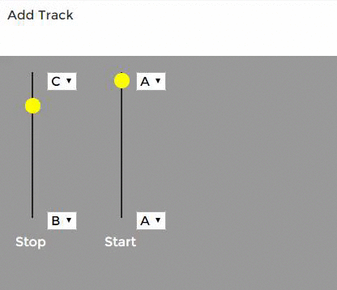

## Audio Yo Yo

Little javascript instrument made with [Backbone.js](http://backbonejs.org/). Add tracks, select notes, then click `Start` for instant cacophony.

For other Backbone audio experiments, see my basic [audio interface](https://github.com/unlikenesses/backbone.audioInterface) and [drum machine](https://github.com/unlikenesses/backbone.beats).